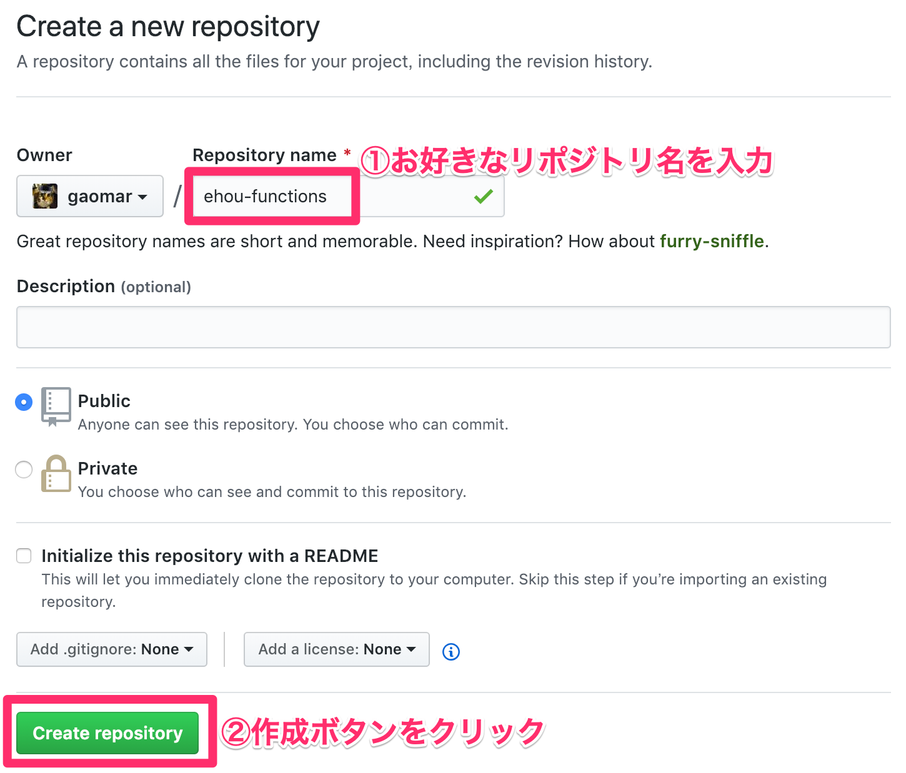

# NetlifyでClovaを動かそう
[Netlify](https://www.netlify.com/)はFunctionsを動かすことができます。
このFunctions機能を使って、Clovaを動かしてみましょう。

AWS LambdaやAzure Functionsなどありますが、クレジットカードの登録が必須なので、学生の方は少し敷居が高いです。

netlifyはgithubアカウントがあれば誰でも無料でFunctions機能を利用することができます。

# 料金
基本無料で利用することができます。  
無料枠は月の利用時間は100時間で、呼び出し回数が12万5千回です。

ちょっとお試しで試す分には十分利用できます。  
https://www.netlify.com/pricing/#addons


# GitHubにリポジトリを作成する
GitHubにリポジトリを作成します。




# ローカルPCにgit環境を整える
ローカルPCにgit環境を整えます。

```
$ mkdir ehou-functions
$ cd ehou-functions
$ git init
$ git commit -m '初回コミット' --allow-empty
$ git remote add origin {GitHubのリポジトリURL}
$ git push -u origin master
```

# Clova関数を作成しよう
`functions`フォルダを作成してそこにプログラムファイルを作成します。

```
$ mkdir functions
$ cd functions
```

`index.js`ファイルを新規作成します。

```javascript:functions/index.js
'use strict';

exports.handler = function (event, context, callback) {
    var response = {
        statusCode: 200,
        headers: {},
        body: ""
    };
    
    var speechText = "";
    var requestJson = JSON.parse(event.body).request;
    var endFlg = false;
    
    if (requestJson.type === 'LaunchRequest') {
        // 起動時処理
        speechText = '恵方巻きの方角を知りたい場合は「今年の方角は」と言ってください。それではどうぞ！';

        responseCall(speechText, endFlg, response, callback);
        
    } else if (requestJson.type === 'SessionEndedRequest') {
        
        speechText = 'また知りたくなったら、呼びかけてくださいね！';
        endFlg = true;
    
        responseCall(speechText, endFlg, response, callback);
        
    } else if (requestJson.type === 'IntentRequest') {

        if (requestJson.intent.name === 'EndIntent' || requestJson.intent.name === 'Clova.NoIntent') {
            // 終了処理
            speechText = 'また知りたくなったら、呼びかけてくださいね！';
            endFlg = true;
        
            responseCall(speechText, endFlg, response, callback);
            
        } else if (requestJson.intent.name === 'Clova.GuideIntent') {
            speechText = 'その年の恵方を答えます。知りたい年を西暦でお答えください。では、どうぞ。';
            
            responseCall(speechText, endFlg, response, callback);
            
        } else if (requestJson.intent.name === 'Clova.YesIntent') {
            speechText = '知りたい西暦を答えてください。。';
            
            responseCall(speechText, endFlg, response, callback);
            
        } else if (requestJson.intent.name === 'MainIntent') {
            
            if (requestJson.intent.slots == null) {
                speechText = "西暦を正しくお応えください。";
                
                responseCall(speechText, endFlg, response, callback);
                
            } else {
                var dt = new Date();
                //年
                var myYear = dt.getFullYear();
                
                if (requestJson.intent.slots.yearword != undefined) {
                    myYear = requestJson.intent.slots.yearword.value.substr(0, 4);
                } else {
                    myYear = requestJson.intent.slots.year.value.substr(0, 4);
                }
                
                var num = myYear % 10;
                var wk;

                switch (num) {
                    case 2: case 7: 
                        wk = "北北西"; break;
                    case 4: case 9:
                        wk = "東北東"; break;
                    case 1: case 3: case 6: case 8:
                        wk = "南南東"; break;
                    default:
                        wk = "西南西"; break;
                }

                speechText = myYear + "年は、" + wk + "です。他に知りたい年はありますか？";  
                responseCall(speechText, endFlg, response, callback);
            }
        }
    }

    
};

// レスポンス処理
function responseCall(speechText, endFlg, response, callback) {
    var responseJson = JSON.stringify({
        "version": "1.0",
        "response": {
            "outputSpeech": {
                "type": "SimpleSpeech",
                "values": {
                    "type":"PlainText",
                    "lang":"ja",
                    "value": speechText
                }
            },
            "card": {},
            "directives": [],
            "shouldEndSession": endFlg
        }
    });
    
    response.body = responseJson;
    
    callback(null, response);
    
}
```

# Netlify環境構築
[Netlify](https://www.netlify.com/)にアクセスして、サインインしてください。

［New site from Git］ボタンをクリックします。


## Githubと連携する
GitHubと連携するので、［GitHub］ボタンをクリックします。


GitHubの画面が表示されるので、［Add another organization］をクリックしてください。


対象のリポジトリを選択します。


リポジトリを選択するとNetlifyの画面に戻り、対象のリポジトリをクリックします。


そのまま［Deploy site］をクリックします。


［Settings］をクリックして、左メニューから`Functions`をクリックします。  
Functionsがあるフォルダを指定します。


［Functions］タブをクリックします。作成したjavascriptファイルをクリックします。  
今回の場合だと`index.js`をクリックします。


エンドポイントURLが表示されるので、コピーしておきます。


# Clovaのエンドポイントを設定する
Clovaデベロッパーセンターのサーバー設定で先程コピーしたURLを指定します。


## Extensions Kitの設定
今回のスキルでは`MainIntent`を作成しました。西暦を取得するためのビルトインスロットタイプを指定します。


## テストする
シミュレーターでテストしてみます。「今年は」と入力すると、今年の恵方がわかります。


# まとめ
無料で簡単にFunctions環境を作成することができました。
サクッと試す場合にはオススメですよ！

システム化のご検討やご相談は弊社までお問い合わせください。  
https://i-enter.co.jp/contact/